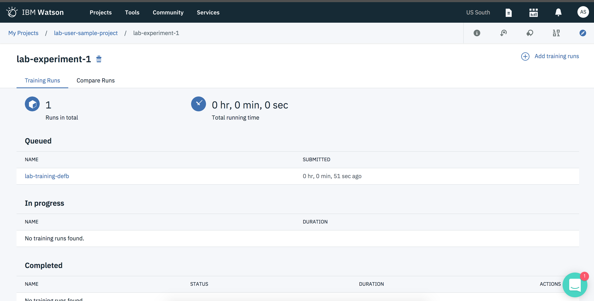
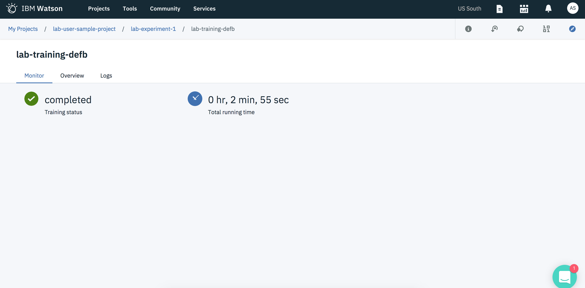
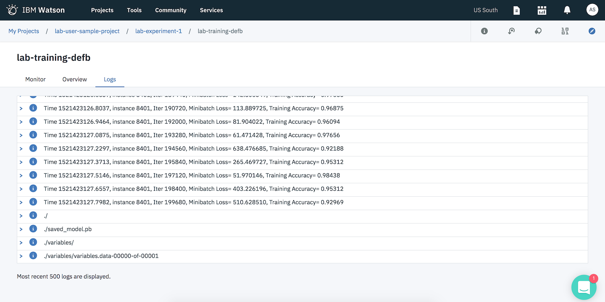

# Following progress of the training

1. You will be redirected to the overview page of the training which will show your experiment to be in `Queued` stage from which it will go to `In progress` and then to `Completed` stage.

2. At any time, you can click on your experiment to get more details about your experiment by clicking on the experiment id to look into logs or get an overview.

3. You can check the logs of your running experiment by clicking on the `logs` tab.

