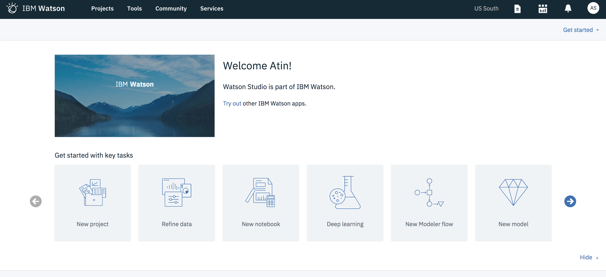
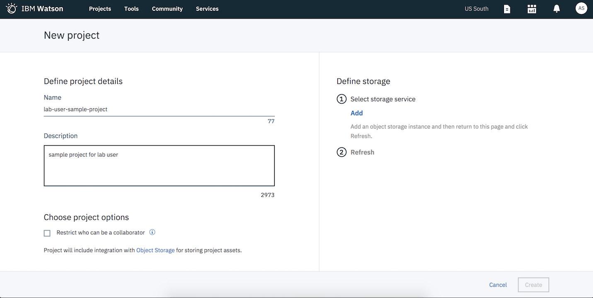
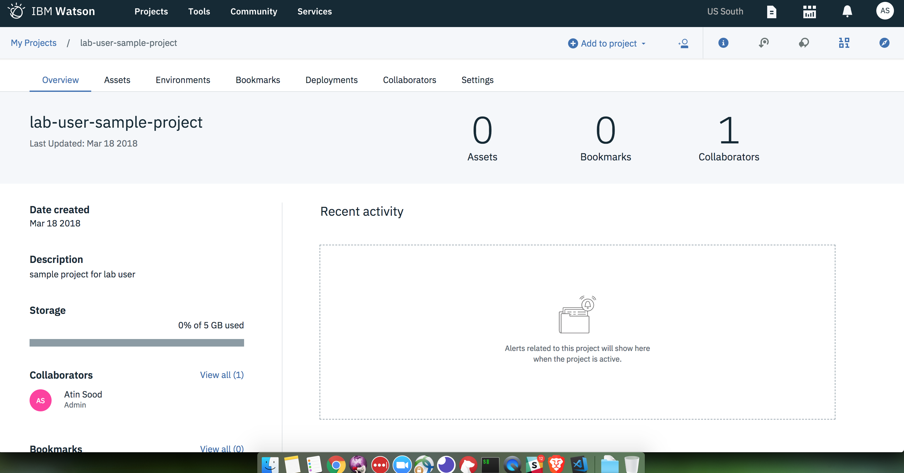

# Signing up for a free trial

0. If you already have a IBM Cloud account, you can sign in to IBM Watson Studio at https://datascience.ibm.com. Otherwise follow step 1 to create IBM Cloud account.

1. Go to https://datascience.ibm.com/ and sign up for a free trial and register for IBM Cloud.

## Creating a new project in IBM Watson Studio

2. Once signed in, click on the tile that says `Deep learning`. Follow the link to the Deep learning page. This page offers multiple ways to `Get started with Deep Learning` service. Scroll to the bottom to find the tile for `Experiment Assistant` which we will be using for this lab.

3. Click on the `Create experiment` tile and this should redirect you to a page asking you to create a project before letting you create an experiment. `Click on the link to create the project.`

4. Follow the instructions and fill in the details for new project  on the left panel.

5. If you are new user you also need to create storage account that can be used to store the data needed for your experiment. Click on the `add storage` link on the left panel and create a `Lite` cloud object storage account. You can use this cloud object storage account independently of using Watson Studio. If you already have an existing Cloud Object Storage account then you can use the same.

6. Once you have create an instance of your cloud object storage account you will be redirected to your `New project` page. This time click `Refresh` under the storage section on the right panel and your cloud object storage account should show up as selected.

7. Click on `Create` button on the bottom right to create a project and link your cloud object storage account with this project.

8. Great, you have covered the first milestone. You have a project and now are you are ready to create experiments. [Follow along]()